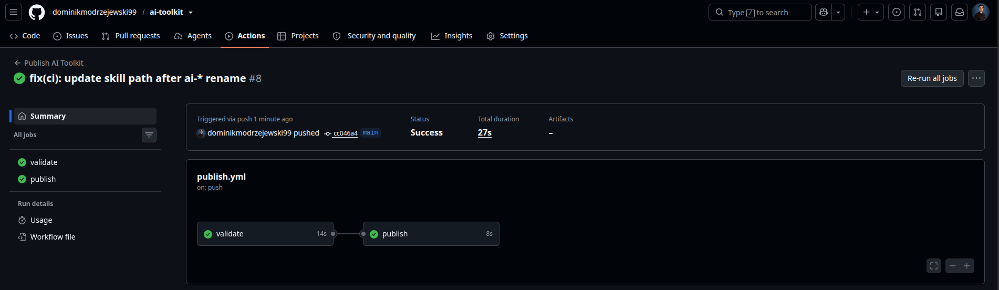
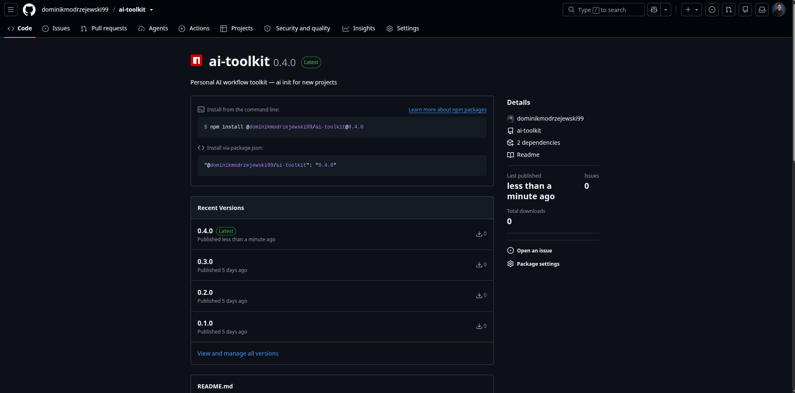
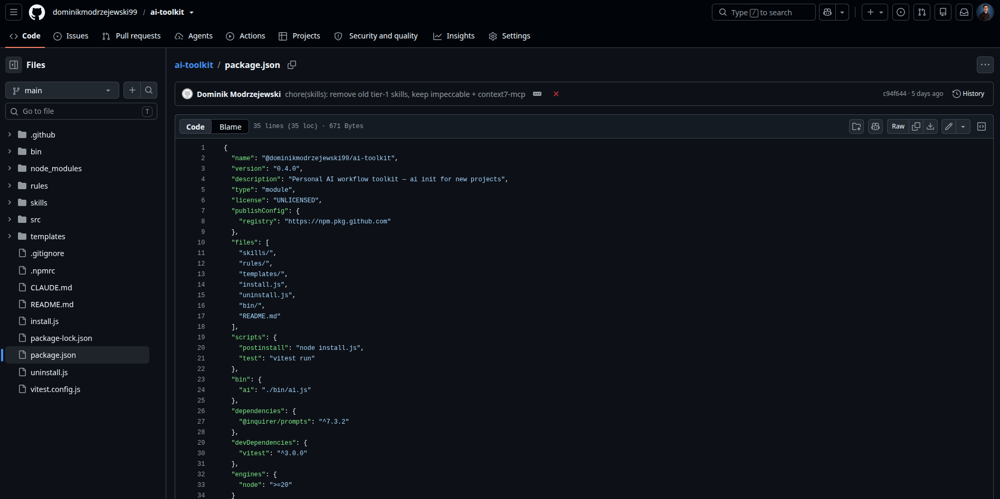

# 10xChampion — Dowód: @dominikmodrzejewski99/ai-toolkit

**Data**: 2026-07-05 (aktualizacja)
**Ścieżka**: Zespołowa paczka dystrybucyjna (M5L4)
**Repozytorium**: https://github.com/dominikmodrzejewski99/ai-toolkit
**Rejestr**: GitHub Packages (`https://npm.pkg.github.com`)
**Aktualna wersja**: `0.4.0`

---

## 1. Repozytorium i rejestr z przepływem



GitHub Actions workflow `publish.yml` — automatycznie uruchamiany przy push na `main`.
Dwa joby w sekwencji: `validate` → `publish`, oba zielone.

Workflow waliduje:
- poprawność `package.json` (name, version, publishConfig)
- obecność i frontmatter `skills/implement/SKILL.md`
- `npm pack --dry-run` bez błędu

Następnie publikuje do GitHub Packages przez `NODE_AUTH_TOKEN: ${{ secrets.GITHUB_TOKEN }}`.

**Historia CI runs (gh run list):**

| Commit | Status | Czas |
|--------|--------|------|
| `refactor(skills): rename 10x-* skills to ai-* prefix` | ✅ success | 26s |
| `feat(skills): add 10x workflow skills (p6)` | ✅ success | 26s |
| `chore: add package-lock.json for npm ci in CI/CD` | ✅ success | 46s |
| `feat(ai-toolkit): tests + CI/CD (p5)` | ❌ failure (fixed next commit) | 13s |

---

## 2. Lista wydanych wersji



Wersje opublikowane w GitHub Packages:

| Wersja | Data | Opis |
|--------|------|------|
| `0.1.0` | 2026-06-30 | Infrastruktura + skills + rules + CLI |
| `0.2.0` | 2026-06-30 | Templates + testy + CI/CD |
| `0.3.0` | 2026-06-30 | Workflow skills (AI change management) |
| `0.4.0` | 2026-07-05 | Refactor: rename `10x-*` → `ai-*` prefix, CI fix — **Latest** |

Komenda instalacji:
```bash
npm install @dominikmodrzejewski99/ai-toolkit@0.4.0 --registry=https://npm.pkg.github.com
```

---

## 3. Definicja paczki



`package.json` na gałęzi `main` — kluczowe pola:

| Pole | Wartość |
|------|---------|
| `name` | `@dominikmodrzejewski99/ai-toolkit` |
| `version` | `0.4.0` |
| `type` | `module` (ESM) |
| `publishConfig.registry` | `https://npm.pkg.github.com` |
| `bin.ai` | `./bin/ai.js` |
| `scripts.postinstall` | `node install.js` |
| `scripts.test` | `vitest run` |
| `files` | `skills/`, `rules/`, `templates/`, `bin/`, `install.js`, `uninstall.js`, `README.md` |
| `engines.node` | `>=20` |

---

## Co robi paczka

- **postinstall** (`install.js`): kopiuje 13 skilli do `.claude/skills/`, wstrzykuje zasady do `CLAUDE.md` między sentinelami, zapisuje manifest `.ai-toolkit-manifest.json`
- **CLI** (`ai init`): interaktywna inicjalizacja projektu — wykrywa stack (Angular/Spring/Next.js/Node/Go/Rust/Generic), pyta o agentów (Claude Code, Copilot, Cursor), generuje `CLAUDE.md`, `.cursorrules`, `copilot-instructions.md`, tworzy `context/`
- **uninstall** (`uninstall.js`): czyści wszystko co zainstalował manifest

**Testy**: 20/20 (Vitest) — detect-stack, file-ops, generate-agents

---

## 4. Dostarczane skille (13)

Kopiowane automatycznie do `.claude/skills/` przy instalacji:

| Skill | Opis |
|-------|------|
| `context7-mcp` | Pobiera aktualną dokumentację bibliotek i frameworków przez Context7 |
| `impeccable` | Projektuje, krytykuje i ulepsza interfejsy frontendowe (UI/UX, dostępność, animacje) |

**AI workflow (change management):**

| Skill | Opis |
|-------|------|
| `ai-new` | Tworzy nowy folder zmiany w `context/changes/<change-id>/` |
| `ai-research` | Eksploruje kod przez równoległe subagenty, zapisuje `research.md` |
| `ai-plan` | Tworzy szczegółowy plan implementacji przez interaktywne pytania |
| `ai-implement` | Realizuje plan fazami z commitami i weryfikacją po każdej fazie |
| `ai-frame` | Przeformułowuje niejasno zdefiniowany problem przed planowaniem |
| `ai-impl-review` | Ocenia implementację względem planu (coverage, deviations, risks) |
| `ai-e2e` | Generuje testy E2E (Playwright/Cypress) przez analizę ryzyka |
| `ai-prd` | Tworzy Product Requirements Document dla nowej funkcji |
| `ai-shape` | Kształtuje zakres i kształt zmiany przed PRD (Shape Up) |
| `ai-roadmap` | Buduje roadmapę produktu z priorytetyzacją |
| `ai-tdd` | Prowadzi implementację w cyklu Red-Green-Refactor |
