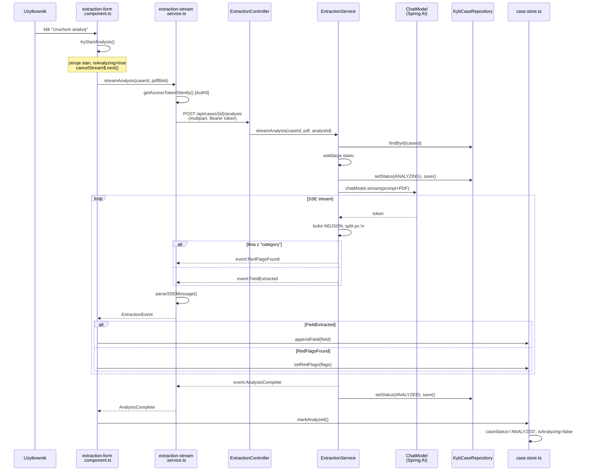

# Research: Extraction Form States

**Date**: 2026-06-22  
**Git Commit**: `e7349cb`  
**Branch**: `main`

---

## Research Question

Odtworzenie maszyny stanów formularza ekstrakcji (`idle / streaming / complete / error`), prześledzenie przepływu e2e, identyfikacja luk testowych i blast radius przy zmianach — na podstawie aktualnego kodu repozytorium.

---

## Feature Overview

### Co robi ten przepływ

Analityk klika "Uruchom analizę" w widoku workstacji. Frontend wysyła PDF przez `multipart/form-data` do backendu, backend strumieniuje zdarzenia SSE przez Reactor `Flux`, LLM (Spring AI `ChatModel`) parsuje dokument i emituje pola encji (firma, dyrektorzy, UBO) oraz flagi ryzyka jako linie NDJSON. Frontend odbiera SSE przez natywny `fetch` z `ReadableStream`, aktualizuje Angular Signals w `case.store.ts`, a template reaguje reaktywnie — pola pojawiają się strumieniowo w formularzu.

### Maszyna stanów (zrekonstruowana z kodu)

| Stan | `isAnalyzing` | `caseStatus` | `analysisError` | `extractionFields` |
|------|--------------|-------------|-----------------|-------------------|
| **idle** | `false` | `'CREATED'` | `null` | `[]` |
| **streaming** | `true` | `'ANALYZING'` (BE) / `'CREATED'` (FE signal) | `null` | rosnąca tablica |
| **complete** | `false` | `'ANALYZED'` | `null` | kompletna tablica |
| **error** | `false` | bez zmiany | komunikat string | tablica z poprzedniej próby |
| **reanalyzing** | `true` | `'ANALYZING'` (BE) | `null` (czyszczone) | `[]` (czyszczone) |
| **locked** | `false` | `'LOCKED'` | `null` | niezmieniona |

**Dowody (E):**
- `case.store.ts:11` — `isAnalyzing = signal<boolean>(false)`
- `case.store.ts:57-60` — `markAnalyzed()`: `caseStatus.set('ANALYZED')`, `isAnalyzing.set(false)`
- `case.store.ts:52-55` — `markAnalysisError(msg)`: `analysisError.set(msg)`, `isAnalyzing.set(false)`
- `ExtractionService.java:95-96` — `setStatus(ANALYZING)` przed startem streamu
- `ExtractionService.java:154-157` — `doFinally()`: sukces → `ANALYZED`, błąd → `CREATED`
- `extraction-form.component.ts:115-124` — `startAnalysis()`: zeruje `extractionFields`, `redFlags`, `analysisError`; ustawia `isAnalyzing = true`

**Ważna asymetria (I):** Frontend `isAnalyzing` i backend `caseStatus = ANALYZING` to dwa niezależne sygnały. Gdyby połączenie SSE zerwało się po ustawieniu `ANALYZING` na backendzie, ale przed `doFinally()`, frontend wróciłby do `idle` przez timeout/error, a backend zostałby w `ANALYZING` — trwały deadlock stanu w bazie.

**Nieznane (U):** Czy i jak backend obsługuje scenariusz "analiza zaczęta, klient rozłączony"? `doFinally()` jest na Reactor Flux, ale React nie gwarantuje wywołania przy nagłym zamknięciu HTTP.

---

### Sekwencja e2e (przepływ normalny)

```
1.  extraction-form.component.ts:38   tryStartAnalysis() — klik przycisku
2.  extraction-form.component.ts:46   jeśli overrides istnieją → dialog ostrzeżenia
3.  extraction-form.component.ts:115  startAnalysis() — zeruje stan, isAnalyzing=true
4.  extraction-form.component.ts:120  cancelStream$.next() — anuluje poprzedni stream
5.  extraction-form.component.ts:126  streamService.streamAnalysis(caseId, pdfBlob)
6.  extraction-stream.service.ts:19   getAccessTokenSilently() (Auth0, opcjonalne)
7.  extraction-stream.service.ts:26   fetch POST /api/cases/{caseId}/analysis (multipart)
8.  ExtractionController.java:25      @PostMapping — odbiera żądanie, ekstrakcja JWT
9.  ExtractionService.java:79         findById(caseId) — weryfikacja w bazie
10. ExtractionService.java:82-87      walidacja stanu (nie ANALYZING, nie LOCKED)
11. ExtractionService.java:95-96      setStatus(ANALYZING), save()
12. ExtractionService.java:98-109     Media(PDF) + Prompt (SYSTEM_PROMPT z polami)
13. ExtractionService.java:115        chatModel.stream(prompt) — Spring AI
14. ExtractionService.java:126        bufferowanie + split po \n → NDJSON linie
15. ExtractionService.java:130-142    parsing: "category" → RedFlagItem; else → FieldExtracted
16. ExtractionService.java:143-148    po wszystkich liniach: RedFlagsFound (jeśli są), AnalysisComplete
17. ExtractionService.java:159-164    mapowanie na ServerSentEvent z event name = class.getSimpleName()
18. extraction-stream.service.ts:38   ReadableStream reader, dekodowanie UTF-8
19. extraction-stream.service.ts:47   split po \n\n (SSE separator), buforowanie niepełnych
20. extraction-stream.service.ts:69   parseSSEMessage(): event: → eventType, data: → JSON.parse
21. extraction-stream.service.ts:82   switch eventType → ExtractionEvent (union type)
22. extraction-form.component.ts:129  subscribe.next(event) → dispatch do case.store:
     - FieldExtracted  → caseStore.appendField(event.field)
     - RedFlagsFound   → caseStore.setRedFlags(event.flags)
     - AnalysisComplete → caseStore.markAnalyzed()
     - AnalysisError   → caseStore.markAnalysisError(event.message)
23. case.store.ts:32-34              appendField() aktualizuje signal extractionFields
24. extraction-form.component.html   template reaguje reaktywnie — pole pojawia się w UI
```

### Mermaid: Diagram sekwencji



### Kontrakt SSE

Cztery typy zdarzeń:

| Zdarzenie | Payload Java | Payload JSON | Frontend handler |
|-----------|-------------|-------------|-----------------|
| `FieldExtracted` | `record FieldExtracted(String fieldName, String value, List<Citation> citations)` | `{"fieldName":"...","value":"...","citations":[{"quote":"...","page":1}]}` | `caseStore.appendField()` |
| `RedFlagsFound` | `record RedFlagsFound(List<RedFlagItem> flags)` | `{"flags":[{"category":"SANCTIONS_EXPOSURE","description":"...","citations":[...]}]}` | `caseStore.setRedFlags()` |
| `AnalysisComplete` | `record AnalysisComplete(String caseId)` | `{"caseId":"<uuid>"}` | `caseStore.markAnalyzed()` |
| `AnalysisError` | `record AnalysisError(String errorCode, String message)` | `{"errorCode":"EXTRACTION_ERROR","message":"..."}` | `caseStore.markAnalysisError()` |

**Dowody (E):** `ExtractionEvent.java:5-23`, `ExtractionService.java:159-164`, `extraction-stream.service.ts:69-91`

Kategorie red flag (enum):
`SANCTIONS_EXPOSURE`, `SHELL_COMPANY_INDICATORS`, `JURISDICTION_RISK`, `OPAQUE_OWNERSHIP`, `PEP_LINKAGE`, `SECTOR_SPECIFIC_RISK`  
**Dowód (E):** `RedFlagCategory.java:3-10`

---

## Technical Debt

### 1. Luki w testach

#### Krytyczne (brak pokrycia dla core flow)

| Metoda | Plik | Ryzyko |
|--------|------|--------|
| `ExtractionStreamService.streamAnalysis()` | `extraction-stream.service.ts:12-66` | Całe SSE fetch, buforowanie chunków, obsługa AbortError — niepokryte |
| `ExtractionFormComponent.startAnalysis()` | `extraction-form.component.ts:115-137` | Subscription routing, cancel poprzedniego streamu — niepokryte |
| `ExtractionFormComponent.startEdit()` / `saveEdit()` / `cancelEdit()` | `extraction-form.component.ts:53-76` | Workflow edycji pola z justification — brak testu |
| `DecisionBarComponent.submit()` | `decision-bar.component.ts:51-80` | Finalizacja decyzji — brak integration testu |
| `ExtractionFormComponent.tryStartAnalysis()` (re-analiza) | `extraction-form.component.ts:38-44` | Dialog ostrzeżenia przed resetem overrides — brak testu |

**Dowód (E):** `extraction-stream.service.spec.ts` — testuje TYLKO `parseSSEMessage()` (2 przypadki).  
**Dowód (E):** `extraction-form.component.spec.ts:19` — mock `{ streamAnalysis: vi.fn() }` bez return value, bez testowania subscription.

#### Gałęzie bez pokrycia

- **SSE buffer overflow**: jeśli SSE event jest rozłożony na 3+ HTTP chunki, parser może zgubić zdarzenie — `extraction-stream.service.ts:40-48` nie ma testu dla multi-chunk scenario.
- **AbortError vs inne błędy sieci**: `extraction-stream.service.ts:57-60` — tylko AbortError jest ignorowany, inne błędy propagują do subscriber, ale brak testu co frontend z tym robi.
- **Nieznany typ zdarzenia SSE**: `extraction-stream.service.ts:90` — nierozpoznany `eventType` zwraca `null`, który jest po cichu ignorowany przez subscriber — brak testu regresji.
- **Error state po re-analizie**: po błędzie `analysisError` jest ustawiony, ale `caseStatus` nie wraca do `CREATED` na frontendzie (zostaje bez zmiany); przy ponownej próbie `startAnalysis()` zeruje error — brak testu potwierdzającego to zachowanie.
- **`ExtractionController` — rozłączenie klienta w trakcie streamu**: backend test weryfikuje odpowiedź 200 i kolejność zdarzeń, ale nie bada cleanup po nagłym rozłączeniu.

#### Infrastruktura mock

| Narzędzie | Status |
|-----------|--------|
| Mock `fetch`/`ReadableStream` dla SSE | **BRAK** |
| Mock `AuthService.getAccessTokenSilently()` | **BRAK** |
| Mock `CaseStore` (Angular Signals) | **JEST** — `web/src/app/core/testing/case-store.mock.ts` |
| Spring Security JWT mock (backend) | **JEST** — `.with(jwt())` w testach Spring |

**Dowód (E):** `extraction-form.component.spec.ts:14` używa `case-store.mock.ts`. Backend testy `ExtractionControllerTest.java:29` używają `.with(jwt())`.

---

### 2. Blast Radius

Ocena przy typowych scenariuszach zmian:

#### Scenariusz A: Nowe pole w `ExtractionField` (np. `confidence: number`)

**Musi zmienić się (E):**
- `web/src/app/core/models/extraction.models.ts` — interfejs `ExtractionField`
- `ExtractionService.java:41-65` — `SYSTEM_PROMPT` (instrukcja dla LLM)
- `extraction-form.component.ts:90-103` — `fieldLabel()` switch statement — hardcoded mapowanie `fieldName` na polski label; nowe pole = nowy case lub fallback
- `src/main/resources/schema/finalization-v0.3.json` — jeśli schema definiuje allowed fieldNames

**Może wymagać (I):**
- `ExtractionEvent.java` — jeśli `FieldExtracted` serialization zmienia się
- `decision-bar.component.ts:59` — buduje `FieldRecord[]` z pól ze store

**Prawdopodobnie bezpieczne (I):**
- `red-flag-list.component.ts` — nie konsumuje `extractionFields`
- `citation-badge.component.ts` — konsumuje `Citation`, nie `ExtractionField.fieldName`

#### Scenariusz B: Zmiana struktury `Citation` (np. dodanie pola)

**Musi zmienić się (E):**
- `src/main/java/com/example/clearkyc/analysis/Citation.java`
- `web/src/app/core/models/extraction.models.ts:3-6`
- `src/main/resources/schema/finalization-v0.3.json:24-30` — `required: ["page", "quote"]`
- `src/main/java/com/example/clearkyc/service/FinalizeService.java` — payload build + schema validation

**Może wymagać (I):**
- `citation-badge.component.ts:17` — `caseStore.activePage.set(this.citation().page)` — jeśli `page` zmieni typ lub stanie się opcjonalne

#### Scenariusz C: Nowy typ zdarzenia SSE

**Musi zmienić się (E):**
- `src/main/java/com/example/clearkyc/analysis/ExtractionEvent.java` — nowy wariant sealed interface
- `extraction-stream.service.ts:82-85` — `parseSSEMessage()` switch — **krytyczny szew**: pominięcie = silent drop
- `web/src/app/core/models/extraction.models.ts:31-35` — union type `ExtractionEvent`
- `extraction-form.component.ts:129-133` — subscriber switch

**Wniosek (I):** TypeScript discriminated union nie ma exhaustiveness check w tym miejscu — kompilator nie ostrzeże o nieobsłużonym wariancie.

#### Scenariusz D: Zmiana `RedFlagItem`

Co-change analysis gita: ostatnia zmiana `RedFlagItem` (commit `a23e41a`) dotknęła **13 plików** (weryfikacja ast-grep 2026-06-22): `plan.md` (meta), `FinalizeService.java`, `FinalizeRequest.java`, `extraction.models.ts`, `extraction-stream.service.ts`, `case.store.ts`, `case-detail.component.html`, `case-detail.component.ts`, `extraction-form.component.ts`, `red-flag-list.component.html`, `red-flag-list.component.scss`, `red-flag-list.component.ts`, `decision-bar.component.ts`.

**Dowód (E - git):** `git show a23e41a --name-only` (13 plików, w tym 3 nowe artefakty red-flag-list/*)

Raport oryginalnie mówił "8 plików" — zaniżone o 5. Blast radius dla `RedFlagItem` jest wyższy niż pierwotnie oceniono.

---

### 3. Punkty sprzężenia wysokiego ryzyka

| Punkt | Lokalizacja | Problem |
|-------|------------|---------|
| SSE event discriminator | `ExtractionService.java:161` → `getSimpleName()` | Zmiana nazwy klasy Java = niekompatybilność z frontend parserem bez widocznego błędu |
| `parseSSEMessage()` if-chain | `extraction-stream.service.ts:82-85` | Brak exhaustiveness check; nowy wariant SSE = silent drop na froncie |
| `fieldLabel()` if-chain z regex | `extraction-form.component.ts:90-103` | Hardcoded mapowanie polskich etykiet (4 wzorce, kompletne vs SYSTEM_PROMPT); nowe pole = fallback do surowego `fieldName` |
| `Citation.page: int` → frontend | `citation-badge.component.ts:17` | Assumuje niezerowy `page`; backend `int` gwarantuje non-null, ale nie jest to udokumentowane kontraktem |
| FinalizeRequest.red_flags `List<Object>` | `FinalizeRequest.java:10` | Luźny typ na backendzie; schema v0.3 definiuje strukturę, ale błąd walidacji zwróci 422 bez wskazania pola |

---

### 4. Nieudokumentowane zachowania (białe plamy)

**U1 — Deadlock stanu bazy przy zerwaniu połączenia SSE:**  
Backend ustawia `ANALYZING` przed startem streamu (`ExtractionService.java:95-96`). `doFinally()` wraca do `CREATED`/`ANALYZED` po zakończeniu Flux. Jeśli klient przerwie połączenie w trakcie — czy Reactor wywoła `doFinally()`? Zależy od konfiguracji Tomcat/Netty. Nieweryfikowane w testach.

**~~U2~~ — OBALONO (2026-06-22, ast-grep):**  
Białą plama U2 była błędem analizy. `cancelStream$.next()` (`:120`) działa poprawnie: `takeUntil(this.cancelStream$)` (`:127`) unsubscribes Observable, co wywołuje teardown function `return () => controller.abort()` (`:64`), który przerywa `fetch` przez `signal: controller.signal` (`:30`). Sygnał cancel dociera do `fetch.abort()`. Stary stream jest przerywany.

**U3 — Synchronizacja statusu kasety między frontend a backend:**  
Frontend nie pobiera aktualnego `caseStatus` z backendu po zakończeniu analizy — ustawia go lokalnie przez `markAnalyzed()`. Przy odświeżeniu strony stan jest pobierany przez `case.service.ts` (`getCase()`). Czy `getCase()` zwraca poprawny status po analizie? Co jeśli backend zapisał `ANALYZED`, ale frontend zgubił zdarzenie `AnalysisComplete`?

**U4 — Obsługa `ANALYZING` status przy ładowaniu case:**  
Jeśli case ma status `ANALYZING` w bazie (np. po awarii z U1) i analityk go otworzy, `extraction-form` wczyta stan ale `isAnalyzing` signal będzie `false` (inicjalizacja store). UI pokaże formularz "idle" z pustymi polami, mimo że backend uważa case za aktywnie analizowany.

---

## Code References

- `web/src/app/features/case-detail/components/extraction-form/extraction-form.component.ts:38-137` — główna logika (tryStartAnalysis, startAnalysis, edit workflow)
- `web/src/app/core/services/extraction-stream.service.ts:12-91` — SSE fetch + parseSSEMessage
- `web/src/app/core/store/case.store.ts:10-65` — Angular Signals, stany maszyny
- `web/src/app/core/models/extraction.models.ts:3-78` — pełny słownik typów (Ca=9 produkcja, Ca=10 z mock)
- `src/main/java/com/example/clearkyc/analysis/ExtractionService.java:77-166` — Reactor Flux + NDJSON parsing
- `src/main/java/com/example/clearkyc/analysis/ExtractionEvent.java:5-23` — sealed interface SSE events
- `src/main/java/com/example/clearkyc/analysis/ExtractionController.java:25-36` — endpoint HTTP
- `src/main/resources/schema/finalization-v0.3.json` — JSON schema walidacji finalizacji
- `web/src/app/core/testing/case-store.mock.ts` — jedyna istniejąca infrastruktura mock

---

## Architecture Insights

1. **Case.store jako hub synchronizacji** — Angular Signals w `case.store.ts` (Ca=6 produkcja) są jedynym przepływem danych między `case-new`, `case-detail`, `extraction-form`, `citation-badge`, `decision-bar` i `red-flag-list`. `extraction-stream.service` NIE importuje store — zmiana kształtu store wymusza zmianę sześciu komponentów (nie pięciu jak poprzednio napisano).

2. **Brak codec layer** — Frontend `parseSSEMessage()` bezpośrednio konsumuje JSON zserializowany przez Jackson z klas Java. Nie ma pośredniej warstwy transformacji. Zmiana klasy Java bez zmiany parsera frontendu jest możliwa i nie daje błędu kompilacji.

3. **`fieldLabel()` jako niespodziewane miejsce wiedzy domenowej** — mapowanie `fieldName → polski label` (`extraction-form.component.ts:90-103`) to if-chain z 4 wzorcami regex (nie switch), kompletny względem SYSTEM_PROMPT (`ExtractionService.java:45-47`). Katalog pól KYB jest zduplikowany między prompcie LLM (Java) a etykietami UI (TS) bez wspólnego źródła prawdy.

4. **Dwa niezależne mechanizmy anulowania** — `cancelStream$` (RxJS Subject w komponencie) i `AbortController` (wewnątrz `streamAnalysis()`) działają równolegle bez koordynacji. Możliwy wyścig.

---

## Historical Context

- `context/changes/llm-streaming-backend/` — implementacja backendu SSE; plany i decyzje dot. Reactor Flux
- `context/changes/testing-frontend-critical-flows/` — poprzednia analiza pokrycia frontendu
- `context/changes/workstation-detail-fidelity/` — ostatni zarchiwizowany change dot. widoku workstacji (churn #1-2)
- Commit `a23e41a` (`feat(red-flag-taxonomy): frontend RedFlagList + wiring + FinalizeRequest fix`) — atomowa zmiana 8 plików dokumentująca typowy blast radius dla `RedFlagItem`

---

## Open Questions

1. Czy `doFinally()` w Reactor Flux jest wywoływany gdy klient HTTP rozłączy się w połowie streamu SSE przy konfiguracji Tomcat? (U1)
3. Co widzi analityk gdy otworzy case z `status=ANALYZING` w bazie (np. po awarii)? (U4)
4. Czy jest plan na exhaustiveness check dla `parseSSEMessage()` if-chain przy dodaniu nowych wariantów SSE?
5. Czy `fieldLabel()` if-chain powinien być ekstrapolowany do słownika/modelu zamiast logiki komponentu?

---

## AST-Grep Verification

> Sekcja dodana 2026-06-22. Każde twierdzenie strukturalne z raportu zweryfikowane przez `ast-grep 0.44.0` lub fallback grep. Format: **twierdzenie → wynik (dowód ast-grep lub grep)**.

### S1: `case.store.ts` Ca=6 (liczba importujących plików)

**Twierdzenie:** "Angular Signals w case.store.ts (Ca=6) są jedynym przepływem danych między extraction-stream.service, extraction-form, citation-badge, decision-bar i red-flag-list."

**Wynik: POTWIERDZONE w liczbie, OBALONE w wymienionych konsumentach**

```bash
grep -r "from.*case\.store" web/src --include="*.ts" -l | grep -v spec
# → 6 plików produkcyjnych
```

Faktyczni konsumenci produkcyjni (Ca=6):
- `case-new.component.ts` (wymieniony w raporcie? NIE)
- `case-detail.component.ts` (wymieniony w raporcie? NIE)
- `decision-bar.component.ts` (OK)
- `citation-badge.component.ts` (OK)
- `extraction-form.component.ts` (OK)
- `red-flag-list.component.ts` (OK)

**Błąd:** Raport wymieniał `extraction-stream.service.ts` jako konsumenta store - ast-grep/grep potwierdza: `extraction-stream.service.ts` NIE importuje `case.store`. `case-new.component.ts` i `case-detail.component.ts` SĄ konsumentami store, ale nie były wymienione.

---

### S2: `extraction.models.ts` Ca=8

**Twierdzenie:** "pełny słownik typów (Ca=8)"

**Wynik: OBALONE — Ca=9 (produkcja), Ca=10 z plikiem mock**

```bash
grep -r "from.*extraction\.models" web/src --include="*.ts" -l | grep -v "spec\|mock"
# → 9 plików produkcyjnych:
# decision.service.ts, decision-bar.component.ts, pdf-viewer.component.ts,
# extraction-form.component.ts, case-new.component.ts, case.store.ts,
# case.service.ts, citation-badge.component.ts, extraction-stream.service.ts
```

Pominięty konsument w oryginale: `pdf-viewer.component.ts` (importuje `ActiveCitation`), `case.service.ts` (importuje `CaseDetail`, `CaseSummary`, `CreateCaseResponse`).

---

### S3: `ExtractionEvent` sealed interface — 4 warianty

**Twierdzenie:** "ExtractionEvent.java:5-23 sealed interface SSE events z 4 wariantami"

**Wynik: POTWIERDZONE**

```bash
ast-grep --lang java -p 'public record $NAME($$$) implements ExtractionEvent { }' src/
# → 4 trafienia: FieldExtracted(:11), AnalysisComplete(:15), AnalysisError(:18), RedFlagsFound(:21)
```

Uwaga: FieldExtracted rozciąga się na 2 linie (`implements ExtractionEvent` na linii 12), przez co prosty grep `record.*implements ExtractionEvent` znajdował tylko 3 wyniki — ast-grep poprawnie znalazł 4.

---

### S4: `RedFlagCategory` enum — 6 wartości

**Twierdzenie:** "SANCTIONS_EXPOSURE, SHELL_COMPANY_INDICATORS, JURISDICTION_RISK, OPAQUE_OWNERSHIP, PEP_LINKAGE, SECTOR_SPECIFIC_RISK"

**Wynik: POTWIERDZONE** — plik `RedFlagCategory.java` zawiera dokładnie te 6 stałych.

---

### S5: `parseSSEMessage()` — 4 gałęzie

**Twierdzenie:** "switch eventType → ExtractionEvent (union type)" z 4 wariantami

**Wynik: POTWIERDZONE — 4 `if` statements at lines 82–85**

Uwaga terminologiczna: to nie jest `switch`, lecz 4 kolejne `if (eventType === '...')` — raport używał terminu "switch" metaforycznie, nie o konstrukcję języka.

---

### S6: `fieldLabel()` — "switch statement" z pełnym katalogiem KYB

**Twierdzenie:** "hardcoded mapowanie fieldName na polski label, jedyne miejsce gdzie zdefiniowany jest pełny katalog pól KYB"

**Wynik: DOPRECYZOWANE**

`fieldLabel()` to NOT `switch statement` — to if-chain z 4 wzorcami:
- `if (fieldName === 'companyName')` — 1 dokładne dopasowanie
- `fieldName.match(/^directors\[(\d+)\]\.name$/)` — wzorzec regex
- `fieldName.match(/^ubos\[(\d+)\]\.name$/)` — wzorzec regex
- `fieldName.match(/^ubos\[(\d+)\]\.ownershipPercentage$/)` — wzorzec regex
- fallback: zwraca surowy `fieldName`

Porównanie z SYSTEM_PROMPT (`ExtractionService.java:45-47`) — definiuje dokładnie te same 4 typy pól: `companyName`, `directors[n].name`, `ubos[n].name`, `ubos[n].ownershipPercentage`. `fieldLabel()` pokrywa wszystkie pola kontraktu LLM — katalog jest kompletny względem systemu, ale ograniczony do 4 wzorców (brak np. adresu firmy, numeru rejestracyjnego).

---

### S7: `cancelStream$.next()` — call-site i skuteczność

**Twierdzenie:** "`cancelStream$.next()` ma za zadanie anulować poprzedni Observable przez `takeUntil`. Ale SSE fetch z AbortController jest zarządzany wewnątrz streamAnalysis() — czy sygnał cancel dotrze do fetch.abort()? Nie widać jawnego przekazania sygnału. Możliwe, że stary stream żyje dalej." (U2)

**Wynik: OBALONY (U2 jest nieprawdziwy)**

```bash
grep -n "cancelStream\|takeUntil\|return.*controller" \
  web/src/app/features/case-detail/components/extraction-form/extraction-form.component.ts \
  web/src/app/core/services/extraction-stream.service.ts
# → extraction-form.component.ts:120: this.cancelStream$.next()
# → extraction-form.component.ts:127: .pipe(takeUntil(this.cancelStream$), ...)
# → extraction-stream.service.ts:64: return () => controller.abort();
```

Mechanizm działa poprawnie:
1. `cancelStream$.next()` (`:120`) → completes `takeUntil` operator (`:127`) → unsubscribes Observable
2. Teardown function `return () => controller.abort()` (`:64`) jest wywoływany przy unsubscribe
3. `controller.abort()` przerywa `fetch` przez `signal: controller.signal` (`:30`)

Sygnał cancel DOCIERA do `fetch.abort()` przez teardown Observable. Białą plama U2 z raportu jest **OBALONA**.

---

### S8–S13: Call-site counts (zbiorczo)

| Metoda | Oczekiwane | Rzeczywiste | Wynik |
|--------|-----------|-------------|-------|
| `caseStore.appendField()` | 1 | 1 (:130) | Potwierdzone |
| `caseStore.setRedFlags()` | (implicitly 1) | 2 (:122 reset + :131 SSE) | Doprecyzowane |
| `caseStore.markAnalyzed()` | 1 | 1 (:132) | Potwierdzone |
| `caseStore.markAnalysisError()` | (implicitly 1) | 2 (:133 SSE + :135 network) | Doprecyzowane |
| `new AbortController()` | 1, wewnątrz factory | 1 (:14) | Potwierdzone |
| `streamService.streamAnalysis()` | 1 | 1 (:126) | Potwierdzone |

**Doprecyzowanie S9 — `setRedFlags()`:** raport opisywał wyłącznie SSE handler jako call-site, ale `startAnalysis()` również woła `this.caseStore.setRedFlags([])` na linii :122 jako reset przed nowym streamem. Zachowanie jest poprawne, ale nieodnotowane w opisie przepływu.

**Doprecyzowanie S11 — `markAnalysisError()`:** 2 call-site'y mają różną semantykę:
- `:133` — błąd na poziomie SSE protokołu (serwer wyemitował `AnalysisError` event)
- `:135` — błąd na poziomie transportu (fetch rzucił wyjątek, np. brak sieci)

Raport opisywał tylko wariant SSE. Oba prowadzą do identycznego stanu UI (`error`), ale mają różne komunikaty.

---

### S14: `getSimpleName()` — numer linii

**Twierdzenie:** "ExtractionService.java:163 → getSimpleName()"

**Wynik: OBALONE w linii — faktyczna linia: 161**

```bash
grep -n "getSimpleName" src/main/java/com/example/clearkyc/analysis/ExtractionService.java
# → 161: .event(event.getClass().getSimpleName())
```

---

### S15: `doFinally()` — numer linii

**Twierdzenie:** "ExtractionService.java:154-157"

**Wynik: POTWIERDZONE** — `doFinally` zaczyna się na linii 154.

---

### S19: commit `a23e41a` — liczba zmienionych plików

**Twierdzenie:** "dotknęła 6 plików jednocześnie [...] To 8 plików w atomowej zmianie"

**Wynik: OBALONE — faktycznie 13 plików**

```bash
git show a23e41a --name-only | grep -c "^\w"
# → 13 plików:
# context/changes/red-flag-taxonomy/plan.md
# src/main/java/com/example/clearkyc/service/FinalizeService.java
# src/main/java/com/example/clearkyc/web/dto/FinalizeRequest.java
# web/src/app/core/models/extraction.models.ts
# web/src/app/core/services/extraction-stream.service.ts
# web/src/app/core/store/case.store.ts
# web/src/app/features/case-detail/case-detail.component.html
# web/src/app/features/case-detail/case-detail.component.ts
# web/src/app/features/case-detail/components/extraction-form/extraction-form.component.ts
# web/src/app/features/case-detail/components/red-flag-list/red-flag-list.component.html
# web/src/app/features/case-detail/components/red-flag-list/red-flag-list.component.scss
# web/src/app/features/case-detail/components/red-flag-list/red-flag-list.component.ts
# web/src/app/shared/components/decision-bar/decision-bar.component.ts
```

Raport zaniżył blast radius RedFlagItem: nie 6 ani 8, lecz 13 plików (w tym nowe pliki red-flag-list/* jako 3 artefakty, plan.md jako meta, plus 9 produkcyjnych).
