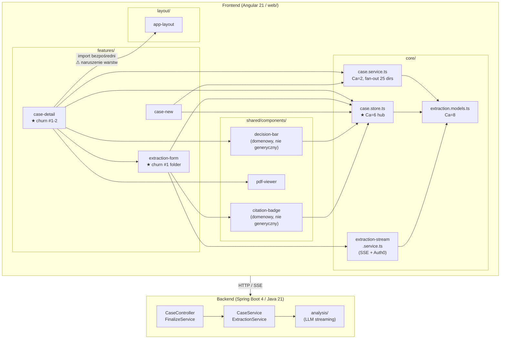

# Repo Map - ClearKYC

> Dokument onboardingowy. Synteza trzech artefaktów: [aktywność](artifact-1-territory.md) + [struktura](artifact-2-structure.md) + [autorstwo](artifact-3-contributors.md).
> Okno: 2026-05-20 - 2026-06-22 (5 tygodni, 90 commitów). Ograniczenia - patrz sekcja 7.

---

## 1. TL;DR

ClearKYC to narzędzie KYB dla analityków bankowych: analityk wgrywa jeden PDF z dokumentacją spółki, LLM ekstrahuje encje (firma, dyrektorzy, UBO) strumieniując wyniki do formularza, analityk weryfikuje i zatwierdza decyzję (Approve/Reject/Escalate). Stack: Spring Boot 4 na backendzie, Angular 21 w katalogu `web/`. Cała aktywność frontendu skupia się w jednym miejscu - widoku workstacji (`case-detail` + `extraction-form`), który zmienił się 50 razy w 5 tygodniach. Ukrytym centrum grafu zależności jest `case.store.ts` (Ca=6): to jego kształt synchronicznie zmienia `extraction-form`, `decision-bar` i `citation-badge` - nie ich logika biznesowa. Projekt ma jednego ludzkiego autora i 91% commitów powstało przy wsparciu AI; jedyną trwałą dokumentacją decyzji architektonicznych jest katalog `context/changes/`.



---

## 2. Teren

### Centrum vs. peryferia

Centrum (gdzie boli): **widok workstacji analityka**. Foldery `case-detail` (24 zmiany) i `extraction-form` (26 zmian) to łącznie 50 z ok. 200 zmian plików w projekcie. Każda zmiana kontraktu SSE, modelu ekstrakcji lub layoutu tutaj ląduje.

Peryferia (bezpieczna strefa): `landing/`, `auth.guard.ts`, `app.routes.ts`, `onboarding-overlay`. Zmieniają się rzadko i mają Ca=1 lub Ca=0.

### Moduły głębokie vs. płytkie

**Głębokie** (dużo wychodzących zależności, trudne do testowania w izolacji):
- `case-detail.component.ts` - Ce=12, I=92% - god component orkiestrujący cały widok
- `extraction-form.component.ts` - Ce=8, I=80% - RxJS streaming + store + child components
- `case-new.component.ts` - Ce=8, I=89% - upload + router + store

**Płytkie** (mało zależności, łatwe do izolacji):
- `case.service.ts` - Ce=4, standardowy HttpClient, testowany `HttpTestingController`
- `case.store.ts` - Ce=2, Angular Signals + modele - prosty sam w sobie
- `citation-badge.component.ts` - Ce=3, mały komponent

### Aktywność w czasie

Projekt ma 5 tygodni historii, niejednorodnie rozłożonych:

```
W1 (20-25 maj)  Bootstrap: Spring Initializr, CI/CD na Fly.io
W2 (26 maj-1 cz) PEAK: frontend + backend rosną równolegle, FinalizeService + case-detail
W3  (2-8 cze)   Testy + integracja: spec-pliki, CaseController, CaseService
W4  (9-15 cze)  Przerwa - zero commitów
W5 (16-22 cze)  UI polish: extraction-form, decision-bar, onboarding-overlay
```

Backend był aktywny głównie w W2-W3 i od tego czasu nie był ruszany. Cały W5 to frontend.

---

## 3. Realne powiązania

### Co naprawdę zmienia się razem - i skąd to wiemy

**Klaster analityczny: `extraction-form` + `decision-bar` + `citation-badge`**
- Źródło: historia git (co-change analysis) - 8 wspólnych commitów dla pary, 5 dla trojki.
- Źródło: graf importów (dependency-cruiser) - wszystkie trzy importują `case.store.ts` bezpośrednio.
- Interpretacja: nie chodzi o logikę biznesową między tymi komponentami, ale o wspólne sprzężenie ze store. Zmiana kształtu stanu = zmiana we wszystkich trzech. Patrz `context/map/store-hub.svg`.

**Backend tryptyk: `service` + `web` (controller) + `web/dto`**
- Źródło: historia git - 4-7 wspólnych commitów.
- Graf importów backendu: **UNKNOWN** - Java nie ma skonfigurowanego narzędzia do analizy zależności (odpowiednik dependency-cruiser dla JVM nie jest w repo).
- Interpretacja: atomowa zmiana przez wszystkie warstwy BE przy każdej zmianie kontraktu API - zdrowy sygnał architektury, ale nie zweryfikowany grafem.

**`case-new` + `decision-bar` + `file-dropzone`**
- Źródło: historia git (3-4 wspólne commity) - niespodziewane, bo to oddzielne widoki.
- Graf importów: `case-new` i `case-detail` nie importują siebie nawzajem; powiązanie biegnie przez `case.service.ts` i `case.store.ts`.
- Interpretacja: zmiana kontraktu HTTP (np. nowe pole w POST /cases) propaguje do obu widoków jednocześnie.

### Naruszenia granic warstw

Wszystkie znalezione przez dependency-cruiser (`npm run depcruise`):

1. **`case-detail` → `app-layout`** (features importuje layout) - nie wychwycone przez żadną regułę. Brakuje reguły `no-feature-to-layout`.
2. **`shared/` → `core/store` i `core/services`** - `decision-bar`, `citation-badge`, `pdf-viewer` są domenowo zabetonowane. Brakuje reguły `no-shared-to-core-store-or-services`.

Brak cykli (0 w całym grafie frontendu). `core/` → `features/` jest czyste.

### Co nie jest objęte grafem

Backend (`src/main/java/`) - **UNKNOWN**. Nie ma odpowiednika dependency-cruiser dla Javy. Powiązania `CaseController` ↔ `CaseService` ↔ `FinalizeService` ↔ `ExtractionService` są widoczne tylko przez ręczną lekturę kodu lub przez historię git (co-change), nie przez analizę statyczną.

---

## 4. Strefy ryzyka

| # | Strefa | Dlaczego ryzykowna | Skąd wiemy |
|---|--------|--------------------|------------|
| 1 | `case.store.ts` + 6 konsumentów | Zmiana kształtu stanu wymusza synchroniczną aktualizację w `shared/` i `features/` jednocześnie - przez dwie warstwy architektoniczne | Graf importów (Ca=6) + historia git (co-change klastra) |
| 2 | `extraction-stream.service.ts` | Auth0 + SSE + environment.ts: jedyna zależność w projekcie której nie da się testować standardowym `HttpTestingController`; zmiana protokołu wymaga rozumienia trzech niezależnych systemów naraz | Graf importów (Ce=5, 3 zewnętrzne) + brak mock infrastructure w repo |
| 3 | `case-detail.component.ts` | Ce=12 i I=92% przy churnie #1; importuje `AppLayoutComponent` bezpośrednio (naruszenie warstw nie wychwycone przez reguły); 9+ mocków do testu jednostkowego | Graf importów + historia git + dependency-cruiser (brakująca reguła) |
| 4 | `shared/decision-bar` + `citation-badge` | Sklasyfikowane jako "reużywalne" (`shared/`), faktycznie domenowe: czytają `case.store.ts` bezpośrednio. Nowy developer może naśladować ten wzorzec głębiej zabetonowując domenę w warstwie wspólnej | Graf importów (`shared → core/store`) + historia git (churn #3, trojka co-change) |
| 5 | `extraction-form` - stany ekstrakcji | Folder #1 churn (26 zmian), Ce=8, RxJS operators + SSE stream + store; maszyna stanów (idle/streaming/complete/error) nie ma dokumentacji - istnieje tylko w sesjach AI, których kontekst przepadł | Historia git + graf importów + brak spec dla stanów pośrednich |

---

## 5. Kogo zapytać

Projekt ma jednego ludzkiego autora. Pytanie "kogo zapytać" ma dwa wymiary: kto ma wiedzę dziś, i gdzie ta wiedza jest utrwalona.

**Dominik Modrzejewski** - jedyny ludzki autor (90/90 commitów). Głęboka wiedza własna (niezapośredniczona przez AI):
- Wymagania biznesowe i logika domeny KYB
- Decyzje UX (streaming skeleton, onboarding tour - czysto ludzkie commity)
- Konfiguracja środowiska: proxy, CORS, porty, Auth0 dev skip

Słabsza wiedza własna (decyzja AI-driven, Dominik definiował wymagania):
- Dlaczego `case.store.ts` zamiast serwisu, dlaczego `shared/` importuje store
- Szczegóły protokołu SSE i flow tokenu Auth0
- Wzorce kompozycji RxJS w `extraction-form`

**Gdzie szukać zamiast pytać:**
`context/changes/` - jedyna trwała pamięć między sesjami AI. Przed zmianą dowolnego obszaru z sekcji 4:

| Strefa ryzyka | Folder w context/changes/ |
|---|---|
| case.store + case-detail flow | `core-case-flow/`, `frontend-scaffold/` |
| extraction-stream + Auth0 + SSE | `llm-streaming-backend/`, `auth-scaffold/` |
| decision-bar, citation-badge | `wcag-ux-review/`, `red-flag-taxonomy/` |
| extraction-form stany | `testing-frontend-critical-flows/`, `field-verification-export/` |

---

## 6. Pierwszy dzień - co przeczytać

Kolejność ma znaczenie: od kontraktu produktowego, przez centrum grafu, do krawędzi technicznych.

**1. `context/foundation/prd.md`**
Kontrakt produktowy: FR-001 do FR-013, non-goals, open questions. Bez niego kod jest bez kontekstu. Przeczytaj przed czymkolwiek innym.

**2. `web/src/app/core/store/case.store.ts`**
Centrum grafu importów (Ca=6). Angular Signals. Zanim dotkniesz czegokolwiek w froncie - zrozum kształt tego stanu. Wszystko czyta stąd.

**3. `web/src/app/core/models/extraction.models.ts`**
Ca=8 - więcej rzeczy zależy od tych typów niż od czegokolwiek innego. Jeden plik, definiuje słownik całego systemu.

**4. `web/src/app/features/case-detail/case-detail.component.ts`**
God component (Ce=12). Importuje layout, store, service, i cztery komponenty shared naraz. Czytaj jako mapę połączeń, nie jako wzorzec do naśladowania.

**5. `web/src/app/features/case-detail/components/extraction-form/extraction-form.component.ts`**
Plik #1 churn w repo. SSE stream → RxJS operators → store → template. Tutaj żyje logika streamingu. Zanim zmienisz cokolwiek tu, zidentyfikuj wszystkie możliwe stany (idle / streaming / complete / error) - nie ma dla nich diagramu.

**6. `web/src/app/core/services/extraction-stream.service.ts`**
Integracja Auth0 + SSE. Jeśli backend zmieni format zdarzeń lub zmieni się provider Auth, zmiana startuje tu. Sprawdź `context/changes/llm-streaming-backend/` przed edycją.

**7. `src/main/java/com/example/clearkyc/service/CaseService.java`**
Wejście do backendu. Co-change z `FinalizeService` i `CaseController` w 4-7 wspólnych commitach. Graf zależności backendu jest nieznany (brak narzędzia) - czytaj przez `git log -- src/main/java/` żeby zrozumieć co zmienia się razem.

**8. `context/changes/` (katalog jako całość)**
Nie plik, ale nawyk: przed każdą zmianą w strefach ryzyka (sekcja 4) sprawdź odpowiedni `plan.md` i `change.md`. To jedyna dokumentacja decyzji z sesji AI, które nie zostawiły śladu w kodzie.

---

## 7. Ograniczenia

**Okno czasowe:** historia liczy 5 tygodni (2026-05-20 - 2026-06-22). Projekt ma zero historii sprzed tego okresu - nie ma "starego kodu" do odróżnienia od nowego.

**Metoda aktywności:** churn z `git log` liczy commity, nie linie. Plik z 3 commitami po 200 linii waży tyle samo co plik z 3 commitami po 1 linii. Liczby są indeksem uwagi, nie rozmiaru zmiany.

**Graf zależności:** dotyczy wyłącznie frontendu Angular (`web/src/app`, 40 modułów). Backend Java - **UNKNOWN** - nie ma skonfigurowanego narzędzia. Powiązania backendowe wnioskowane są wyłącznie z historii git (co-change), nie z analizy statycznej.

**Autorstwo:** 91% commitów to współpraca człowiek + AI (Claude). Przypisanie wiedzy do "Dominik wie" vs "AI wiedziało" jest przybliżone - oparte na czysto ludzkich commitach (8/90) i charakterze pracy per zakres.

**Co mapa nie mówi:**
- Jaka jest złożoność biznesowa poszczególnych przepływów (mapa aktywności, nie złożoności)
- Czy kod jest poprawny (mapa struktury, nie jakości)
- Jak backend łączy się wewnętrznie (brak grafu Java)
- Co zmieniło się przed 20 maja (brak historii)
- Czy `context/changes/` jest kompletne i aktualne dla każdego obszaru

**Następny krok jeśli mapa jest niewystarczająca:** uruchom `npm run depcruise` na świeżej wersji kodu i porównaj z `artifact-2-structure.md`. Dla backendu: rozważ dodanie [jQAssistant](https://jqassistant.org/) lub [ArchUnit](https://www.archunit.org/) żeby uzyskać graf zależności równoważny dependency-cruiser.
